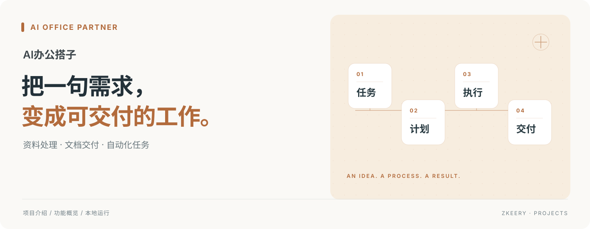
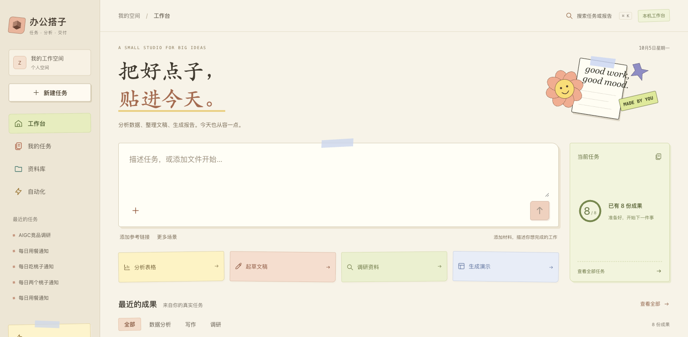

<p align="center"><strong>把材料变成报告，把重复工作交给自动化。</strong></p>
<p align="center">本机办公工作台 · Next.js + FastAPI · 单 Agent 工作流</p>
<p align="center"><a href="#能做什么">能做什么</a> · <a href="#快速开始">快速开始</a> · <a href="docs/README.md">使用文档</a></p>

## 这是什么

AI办公搭子面向运营、产品和项目工作：描述要完成的任务，添加材料或参考链接，就能整理数据复盘、周报、会议纪要和调研简报初稿。结果留在工作台，支持继续修改、查看版本和下载文件。



*工作台本地截图；任务名称和成果数量来自截图时的使用记录。*

## 能做什么

| 你的工作 | 搭子提供的能力 |
| --- | --- |
| 整理零散材料 | 上传文件、添加链接，生成结构化文稿与报告 |
| 分析业务表格 | 读取 CSV / XLSX，计算汇总、分组和月度变化，展示图表 |
| 交付办公文件 | 下载 Word、Excel、PPT、Markdown；支持章节改写和版本恢复 |
| 重复执行任务 | 设置执行时间，查看自动化跑次与结果；可配置飞书文档导出 |

## 怎么用

1. 描述目标，例如「分析这份销售表，整理本月复盘」。
2. 添加材料或参考链接，提交任务。
3. 查看执行状态与报告，需要时修改章节或全文。
4. 下载文件；重复任务可设置自动执行时间。

底层采用单 Agent 的 Plan–Execute 流程：模型生成计划，程序按步骤执行，并保存任务与结果。

## 快速开始

准备 Python 3.12 与 Node.js 24。在第一个终端启动后端：

```bash
git clone https://github.com/Zkeery/AI-office-partner.git
cd AI-office-partner
cp .env.example .env
cd backend
python3.12 -m venv .venv
source .venv/bin/activate
pip install -r requirements.txt
uvicorn app.main:app --host 127.0.0.1 --port 8040 --reload
```

另开终端，在仓库根目录启动前端：

```bash
cd frontend
npm ci
npm run dev
```

打开 [http://127.0.0.1:3040](http://127.0.0.1:3040)。首次默认使用模拟模型、检索与飞书服务，无需密钥即可体验流程；模拟输出不代表真实 AI 效果。接入真实服务时，在本机 `.env` 配置对应密钥并关闭对应 `*_MOCK`，详见[模型接入](docs/模型接入与选择.md)。

## 当前范围

当前适合本机单用户使用，尚未提供完整的多用户登录与权限隔离。报告是待复核的初稿；真实模型、联网检索及飞书导出需要分别配置服务。后端依赖本地数据目录，上云部署需另行配置。

使用方法、故障排查与开发资料统一放在[文档中心](docs/README.md)。
