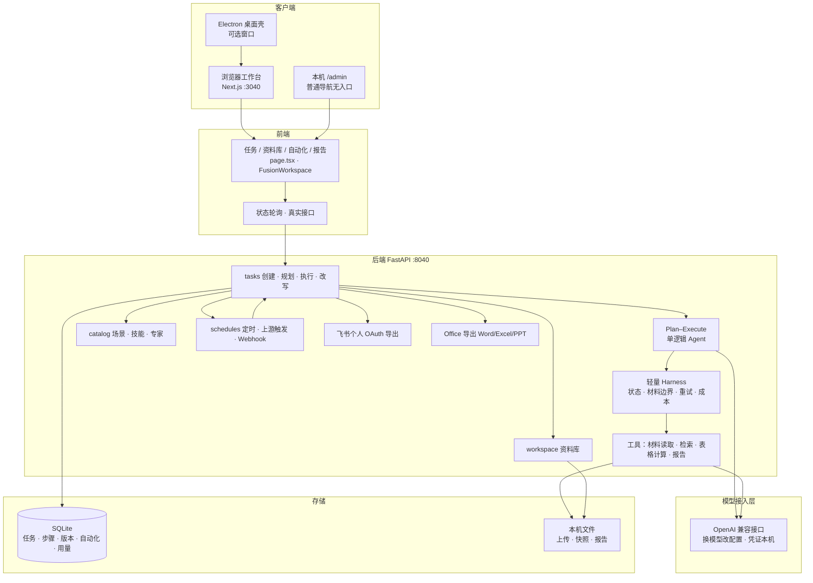
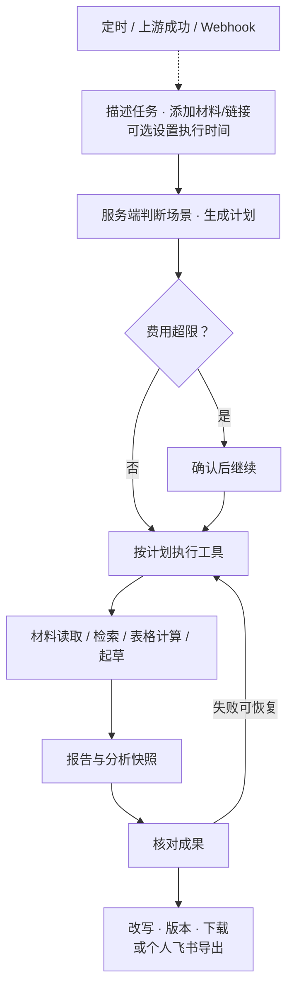

# AI办公搭子 · 当前 PRD

## 文档信息

| 项 | 内容 |
| --- | --- |
| 文档名称 | AI办公搭子 · 当前 PRD |
| 版本 | 当前版（相对历史 1.0 / 1.1 的现行需求稿） |
| 更新日期 | 2026-10-06（含系统架构图）；正文范围事实截至 2026-10-05 |
| 负责人 | 小龙兰 |

## 1. 一句话定义

为经常需要交周报、数据复盘和调研简报的运营、项目及产品人员，提供一个个人办公工作台：把用户已有的材料和任务要求，转成可核对、可修改、可下载的中文办公初稿。

用户要完成的工作是“按要求交出一份成果”。首要体验围绕任务要求、材料、执行时间、结果和修改组织；模型、规划、技能与工具调用由系统内部处理，不要求用户理解或选择。

产品采用单逻辑 Agent 的 Plan–Execute 架构：模型根据需求生成结构化计划，程序执行器按步骤调用工具并生成成果。任务编排指步骤与工具的组织；规划、执行及提示词中的“专家”不代表多个独立 Agent 协作。

自研轻量 Harness 是本产品的运行控制层，负责状态、材料边界、工具调用、持久化、恢复、重试与内部成本保护。当前交付是个人 AI 办公工作台，Harness 服务于本项目，不作为独立通用平台交付。

## 2. 为什么要做

典型任务并不止于“写一段话”。一份经营复盘通常要经历找材料、理解字段、核算数字、解释变化、组织文稿、做汇报文件、按反馈重改。用户现在往往在聊天工具、搜索、Excel、Word 和 PPT 之间搬运内容，且需要自己判断数字是否准确、原料是否读全、当前文件是不是最新版本。

本产品要减少三类具体负担：

1. **整理负担**：零散记录、表格和链接难以迅速变成符合场景的结构。
2. **复核负担**：生成了流畅文字，仍不知道关键数字怎么来的、来源在哪里、哪些内容待确认。
3. **交付负担**：同一任务要做文稿、表格或演示初稿，修改后又要重新整理和导出。

这些是基于现有需求和工作流形成的产品假设；目前没有访谈样本、市场规模、付费转化或节省时间数据，不能写成已经验证的市场结论。继续投入的依据应是：在少数重复发生的任务上，用户确实更快交付、少返工，并愿意再次使用。

## 3. 为谁做，谁先用

| 用户 | 工作情境与责任 | 最需要解决的问题 | 优先级 |
| --- | --- | --- | --- |
| 运营人员、业务分析兼岗人员 | 每周/月拿到活动、渠道、销售或服务数据，要给负责人解释变化 | 手工汇总耗时；容易把统计口径和业务解释混在一起；报告需要能追到原始数字 | 第一优先：数据复盘 |
| 项目负责人、项目协调者 | 周会前收集进展、阻塞项和下周安排，向上汇报并跟进 | 记录分散，整理格式反复，容易遗漏未完成事项和责任人 | 第一优先：项目周报 |
| 产品、市场研究人员 | 做方案或评审前，需要快速理解竞品、行业或一个专题 | 搜索与摘要耗时，来源难核对，生成稿容易混入未经证实的结论 | 第二优先：调研简报 |
| 行政、客户运营等写作用户 | 会后整理文字记录，或准备通知、邮件、回复稿 | 把事实改成合适语气和结构，不希望模型擅自承诺、编造时间和责任人 | 保留支持，作为辅助场景 |

“运营、项目、产品人员”是对原有“个人职场人”范围的具体化和优先顺序，不是已完成用户研究的结论。当前先由产品负责人自用验证，再邀请有上述重复任务的少量用户试用。

使用条件：有权处理相关材料，允许必要内容发送给维护者配置的模型；能够在维护者协助下完成本机安装和模型配置。当前没有面向普通用户的一键安装、引导配置和自动更新闭环，因此不能宣传为已经零门槛。

本阶段不把企业管理员、多人审批协作、专业 BI 团队、需要复杂跨表关联的分析师或通用电脑自动化用户作为首要目标。保留现有功能，但不为这些人群扩展新的系统。

## 4. 需求应写成用户要完成的事

| 需求 | 用户真实表达 | 产品应承担的工作 | 用户仍负责的判断 |
| --- | --- | --- | --- |
| D-01 快速形成初稿 | “周会前，我要把这周做了什么、哪里卡住、下周做什么整理好。” | 提取事实，按场景组织，缺失信息标出来 | 检查事实、语气和对外表述 |
| D-02 数字可复核 | “告诉我本月哪里涨了、哪里降了，别把数字算错。” | 完整读取支持范围内的数据，确定性计算，展示口径和结果 | 确认字段含义、统计口径与业务原因 |
| D-03 依据可追溯 | “这条判断来自哪里，是资料里写的还是推测？” | 展示来源或材料依据，区分事实、推断和待核实项 | 判断来源权威性及是否足以支持决策 |
| D-04 修改不重做 | “只把风险部分改短，其他不要动，必要时退回上一版。” | 局部改写、版本记录、冲突提示和恢复 | 选择最终可交付版本 |
| D-05 成果能继续使用 | “我要发 Word，开会用 PPT，数字要留在 Excel 里。” | 生成相应可编辑文件，并说明各格式包含的内容 | 在 Office 中做最终排版、审核与发送 |
| D-06 重复任务能复用 | “下周还要做相同的整理，不想从头设置。” | 复用场景和要求；自动化明确运行材料、周期、失败与费用 | 更新输入，决定何时外发和是否接受结果 |

“能写周报”“支持 PPT”只是功能名；验收必须落到以下场景中的输入、结果和失败处理。

## 5. 具体场景与完成标准

### S1：运营月度数据复盘（首要场景）

**触发**：月初，运营需要把上月渠道或区域表现发给负责人。手里已有 CSV/XLSX，通常包含日期、分组维度、金额或数量。

**现有困难**：要手工核算总数、按地区/渠道汇总、比较月份，再把结论整理进文档和演示文件。数字、图和文字容易对不上。

**任务示例**：“根据这份销售表，说明各区域销售额、月度变化和异常数据，给我一份复盘初稿，并附可复算 Excel。”

**流程**：上传或明确选定表格 → 说明分析目标 → 程序读取与计算 → 展示完整行数、汇总和图表 → 形成说明与结论 → 用户检查口径 → 下载或按章节修改。

**交付标准**：支持范围内的数据不能只抽样；金额、数量等指标能与原表复算；缺失值、非数字与基期缺失必须说明；原因没有材料支持时写为假设或待核实。Excel 保留数据、复算公式与原生图表，文稿可下载，PPT 作为汇报初稿。

**当前边界**：已实现按工作表汇总、分组、月度变化与异常。不能承诺任意业务口径、跨表关联、复杂 SQL、预测建模或自动识别所有百分比的加权规则。当前每表主要图表指标由程序选择，尚无完整的用户口径配置界面；多币种等语义需用户预先处理或确认。

### S2：项目周会前整理周报（首要场景）

**触发**：周五汇报前，项目负责人有几段工作记录、访谈结论或任务清单，需要交一份简明周报。

**现有困难**：事实分散，重复整理；很容易把“计划完成”写成“已经完成”，或遗漏阻塞事项。

**任务示例**：“本周完成登录页和 3 次访谈；支付联调未完成，负责人小陈。下周做联调和试用反馈。请整理进展、风险和下周计划。”

**流程**：粘贴要点或上传材料 → 描述周报要求 → 系统判断场景并起草 → 对照事实 → 仅改风险章节或语气 → 下载 Word，保留版本。

**交付标准**：不捏造完成状态、责任人、日期和业绩；输入缺少的信息明确留待补充；章节外内容不因局部修改改变。周报初稿无需联网时，不添加无关网络信息。

**当前边界**：普通文档容量内完整提取文本，DOCX 按正文顺序读取段落和表格；单文档 60,000 字符、任务文档合计 90,000 字符，超限明确失败。复杂版式不保证还原，扫描 PDF 无 OCR，空文本明确报错。

### S3：会议结束后整理决议与行动项

**触发**：参会者已有文字笔记或转写稿，需要把讨论整理成可确认的纪要。

**现有困难**：讨论过程很长，但真正需要传达的是决定、争议、待办、负责人和时间。

**输入与输出**：输入文字记录；输出摘要、已确认决议、行动项表和待确认事项。行动项包含事项、责任人、截止时间、依据；原记录未给出的字段保持“待确认”。

**完成标准**：不能把讨论建议写成已通过的决议；不能擅自派发任务或通知他人。用户审核后自行发送或主动导出。

**当前边界**：仅处理用户提供的文本材料；没有录音、语音识别、自动入会、会议系统同步或扫描件 OCR。

### S4：方案评审前做专题/竞品简报

**触发**：产品或市场人员接到一个研究问题，需要在评审前形成可讨论的材料。

**现有困难**：搜索结果多，信息时间和适用条件不同；直接让模型回答又难以分清事实与猜测。

**输入与输出**：输入研究对象、问题、时间范围及可选链接；输出结构化简报、对照表、结论、来源链接和待核实项，支持 Word/Markdown/PPT 初稿。

**完成标准**：重要事实能找到对应来源；明确访问时间或资料日期；没有找到来源时不编造；结论区分事实与推断；相互矛盾的证据须展示，不静默择一。

**当前边界**：已实现 Tavily 接口、给定网页读取和报告生成；网页正文提取较简单，对登录页、复杂动态网页与付费内容不保证可读。当前来源纪律主要依赖提示词，尚无逐条事实与来源的硬性校验，不能承诺研究结论自动可信。

### S5：对外通知、邮件与客户回复初稿

**触发**：用户已有准确事项、受众与语气要求，要快速形成一份得体文稿。

**问题与结果**：减少措辞和结构整理；提供标题、正文、待补充字段。价格、承诺、交付时间等必须来自用户输入，不能擅自补全。

**当前边界**：可起草与下载，不代替用户发送邮件、客户消息或群通知；个人飞书导出必须由用户主动触发。该场景保留为高频辅助功能，不作为主要竞争优势。

### S6：周期性行业简报与重复整理

**触发**：用户希望按固定周期重复一个已跑通的任务。维护者可在管理能力中设置上游成功后触发另一个自动化。

**完成标准**：能看见执行时间、跑次、真实状态、材料来源、结果与可处理的错误；同一次运行不重复启动；中断可以恢复或明确失败；费用和对外动作有确定的边界。

**当前边界**：普通用户描述重复任务、选择材料与执行时间，可立即执行、启停和查看历史。模型与内部额度由服务端配置，不要求用户选择或填写；材料版本策略和依赖触发属于本机管理能力。保留原子占用、运行开始记录、中断和暂停状态；本机服务必须持续运行，仍不是分布式调度系统。

## 6. 业务场景快捷入口

普通工作台保留业务场景快捷入口（见[用户界面精简](../阶段文档/用户界面精简.md)）：点选后带出模板提示，并写入对应 `skill_id`；自由输入时服务端仍通过 `detect_scene` 自动判断。场景目录来自 `backend/app/catalog/scenes.json`（共 12 个）。

| 场景 ID | 名称 | 类别 | 用途（来自模板/目录） |
| --- | --- | --- | --- |
| competitor_research | 竞品调研 | research | 对比 2～3 个主要竞品的定位、核心功能、优劣势并给出建议 |
| meeting_minutes | 会议纪要 | writing | 根据会议笔记整理纪要（含决议与待办） |
| weekly_report | 周报总结 | writing | 整理本周进展、问题与下周计划 |
| email_draft | 邮件稿 | writing | 起草可粘贴发送的工作邮件（含主题建议） |
| proposal_template | 方案模板 | writing | 按背景·目标·方案·实施·风险骨架起草方案 |
| table_analysis | 表格分析 | data | 基于上传 CSV/Excel 做全量分析、图表读图结论与建议（需表格） |
| policy_brief | 政策速读 | research | 政策/通知速读：结论、适用对象、关键变化、影响与建议动作 |
| customer_reply | 对客话术 | writing | 按场景起草可直接对客使用的回复话术 |
| project_update | 项目推进 | writing | 项目推进短更新：进度、阻塞、下一步 |
| speech_script | 汇报发言稿 | writing | 按场合与听众起草可上台念的发言稿 |
| event_retro | 活动复盘 | writing | 活动/项目复盘：目标、结果、原因与改进 |
| internal_notice | 通知公告 | writing | 起草内部通知/公告：对象、事项、时间、行动 |

叙事验收场景见上文 §5（S1–S6）；上表是界面入口与目录的完整清单，二者互补，不以遗漏入口视为未实现。

## 7. 核心流程与异常分支

主流程：描述任务 → 添加材料/链接 → 按需要设置执行时间 → 系统检查输入并自动判断场景、规划与执行 → 核对成果 → 修改/恢复版本 → 下载或用户主动导出。

必须能处理：

- **材料缺失或无效**：在执行前明确指出需要什么，保留已有输入；部分上传失败能返回同一任务处理，不因重试产生重复任务。
- **用户改意图**：移除最后一份表格后重新判断场景，普通写作不应被遗留的表格状态阻断。
- **规划或执行中断**：恢复为可重试、可继续的明确状态；不能永久停在“规划中”。
- **模型失败**：区分连接失败、超时、权限/额度与输出无效；采用有限重试，避免无上限循环和静默换模型。
- **暂停与恢复**：暂停意味着当前任务尚未完成，自动化跑次不得显示成功；重新规划与旧执行器互斥。
- **版本冲突**：另一标签页已保存新版本时提示冲突，保留用户此次修改意图，不覆盖新版本。
- **没有足够证据**：给出缺失材料和待核实项；不把无法完成的分析写成已验证结论。
- **费用超限**：普通任务保留估算软闸门和必要的费用确认。自动化使用内部每跑次额度，默认 50,000 tokens，既有有效额度继续沿用；请求前预留，超额停止。维护者在本机管理页排查或调整，用户无需填写 token 预算。厂商返回用量后对账，缺失用量保留保守预留。
- **导出失败**：保留报告与版本，允许只重试导出，不重复生成整份报告。

## 8. 系统架构

本节概括本机运行架构，依据 [架构方案](../阶段文档/架构方案.md) 与仓库代码核对。前端端口 **3040**，后端端口 **8040**；SQLite 与上传/报告/自动化材料位于本机数据目录。可选 Electron 仅为同一套 Web 的窗口壳。

### 8.1 系统架构概览

普通工作台只提交任务要求、材料与执行时间；模型、技能/专家、预算与材料策略由服务端默认配置与 `/admin` 承载。规划与执行是同一条 Plan–Execute 链，「专家」为 Prompt 角色，不是多 Agent 协作。

### 8.2 主业务流程

异常分支（材料无效、中断恢复、版本冲突、额度停止等）见 §7；Webhook 与上游触发属管理能力，见 §15。

### 8.3 模块职责

| 模块 | 职责 |
| --- | --- |
| 浏览器 / Electron | 贴纸创作室工作台；任务、资料库、自动化、报告；桌面壳可选 |
| `/admin` | 模型接入状态、技能/专家、内部额度、材料策略、跑次诊断 |
| tasks + Plan–Execute | 创建、规划校验、异步执行、暂停/重试、改写与版本 |
| 轻量 Harness | 状态占用、材料边界、有限重试、内部成本保护 |
| catalog | 12 场景入口；技能与专家目录 |
| table_analysis / 导出 | 全量表格计算、原生图表；Markdown/Word/Excel/PPT |
| schedules | 定时、上游成功触发、入站 Webhook、跑次与站内结果 |
| workspace / 飞书 | 资料库选材；个人 OAuth 主动导出云文档 |
| SQLite + 文件 | 任务元数据与用量；上传与报告快照本机保存 |

更细边界见 [架构方案](../阶段文档/架构方案.md)。

## 9. 与其他产品怎么区分

对照依据为 2026-10-04 查阅的官方说明。这里只比较公开定位与本项目已验证实现，未对竞品进行同题质量、成本或性能实测；“官方页面未说明”不能推导为“不支持”。

| 对照对象 | 官方公开定位/能力 | 对本产品的启示与取舍 |
| --- | --- | --- |
| [腾讯 WorkBuddy](https://www.workbuddy.cn/docs/workbuddy/From-Beginner-to-Expert-Guide/Product-Guide) | 全场景桌面办公智能体；自然语言执行、本地文件、文档/表格/PPT、模型切换、Skills、MCP、多智能体 | 功能广度和扩展能力是其明确方向。我们的自然语言、文件生成、多模型兼容接入和自动化并不独有；当前不具备其通用电脑任务覆盖面 |
| [WPS AI / 灵犀](https://ai.wps.cn/introduction) | 官方提供写作、设计、阅读和数据助手等办公入口，围绕文档与 Office 场景 | 文档编辑和成品制作是直接替代路径。本项目当前没有完整的 Office 编辑器，导出文件仍需用户打开 Office 做最终编辑 |
| [飞书 aily](https://www.feishu.cn/content/3d5z9ttt) | 企业智能体平台，提供技能编排、知识数据处理，并连接企业业务系统 | 若用户主要需求是组织知识、协作流转和企业权限，平台型方案更符合其需求；我们当前服务个人本机任务，无企业权限与协作闭环 |
| 手工使用搜索、表格与文字工具 | 用户自行收集、核算、起草、排版和修改 | 本产品应证明这些步骤之间的搬运与返工减少；评价基线必须包含用户现有做法，而不只比较模型回答 |

目前没有证据证明本产品整体优于 WorkBuddy、WPS 或 aily。直接复刻它们的功能清单，无法形成有说服力的差异。

### 可以继续打磨的差异化方向

| 方向 | 用户得到的具体好处 | 已有基础 | 尚需证明/补齐 |
| --- | --- | --- | --- |
| 围绕几种交付任务组织流程 | 清楚要提供什么、检查什么、最终拿到什么 | 中文场景入口、任务状态、报告与导出已有；输入与状态缺口已补回归 | 新用户不用反复调整提示词也能完成首个任务，仍需用户试用 |
| 表格结论可以复算 | 看得到完整行数、指标、图表和可复算文件 | 程序计算、快照、Excel 公式与原生图表已真实验证 | 字段口径确认、复杂材料处理和更多真实样本；不声称竞品没有此能力 |
| 同一任务内修改与追溯 | 改一节、看差异、恢复旧版，再导出 | 章节改写、持久版本、冲突保护已有 | 不同格式内容一致性和用户完成修改的体验仍需场景验收 |
| 任务成果与运行记录可追溯 | 本机保留成果，维护者可核对运行配置与实际型号 | 本机数据库、固定型号、恢复与备份演练已有 | 配置体验与真实用户收益；本机存储不等于离线推理，材料仍可能发送给云模型 |

这些是“已有基础 + 待验证的使用收益”，不是独占技术壁垒。若未来要形成持续优势，应积累经过验收的场景模板、真实失败样本、可复算规则和与用户工作习惯匹配的交付标准，而不是继续增加入口数量。

## 10. 当前范围、优先顺序与不做什么

1. **守住已修复的可靠性**：资料读取边界、文件覆盖、中断恢复、调度状态与重复执行、输入状态遗留、模型错误与依赖维护均纳入回归。
2. **再把 S1、S2 做深**：从实际材料到交付的稳定闭环；补口径、缺失信息提示与少返工的修改流程。
3. **继续验证 S4**：来源质量、可追溯性和明确的不确定性；积累真实研究样例。
4. **最后扩大 S6 与新接入**：材料绑定、预算和调度保护已完成开发验收，扩大使用前仍需真实周期任务验证。

本轮已按用户要求实施 F01–F12 修复；后续优先顺序不删除既有场景，也不将开发回归视作用户收益验证。

本阶段不新增多 Agent 协作、执行中由模型自主重规划、独立 Harness 平台、企业多人隔离、公网部署、通用浏览器 Agent、任意系统脚本执行、插件市场、视频生成、录音转写或完整 Office 编辑器。现有 Electron 仅是窗口壳，不等于已经交付安装包和自动更新。

## 11. 页面与字段

路由与面板以当前前端实现为准（`frontend/app`、`FusionWorkspace`）。

| 路由 / 面板 | 职责 | 主要字段与操作 |
| --- | --- | --- |
| `/` · compose | 新建任务首页 | 任务描述（必填）；业务场景快捷入口；加号上传材料；参考链接（最多 3 个）；发送。不提供模型/技能/专家/预算选择。Enter 提交，Shift+Enter 换行 |
| `/` · tasks | 任务列表 | 搜索（标题、用户输入、报告正文）；多选合并；归档入口；打开任务 |
| `/` · task | 单任务详情 | 计划/步骤进度；报告预览；局部或全文改写（成功后）；版本查看/差异/恢复；下载 Markdown / Word / Excel / PPT；个人飞书导出（需已连接）；暂停/继续/重新规划（依状态） |
| `/` · workspace | 资料库 | 授权本机目录；列表默认偏表格、可搜文件名；上传；选表带入任务。资料库不默认落盘报告 |
| `/` · schedules | 自动化 | 名称、工作内容、执行时间（预设或自定义间隔）、可选材料/链接、启停、立即执行、跑次历史、站内结果。普通表单不填模型与 token 预算 |
| `/design-lab/fusion`、`/design-lab/lilac` | 兼容真实工作台入口 | 与 `/` 共用同一套任务与报告流程 |
| `/design-lab` | 历史设计比较 | 四方向示例页，非现行业务入口 |
| `/admin` | 本机管理页（普通导航无入口） | 默认模型与接入状态、自动化单次内部上限、资料库目录、技能与专家清单、单条自动化内部配置（模型/技能/专家/额度/材料策略/依赖触发）、任务与跑次诊断。密钥由 `.env` 维护，页面不返回密钥 |

隐藏管理入口不构成服务端角色鉴权。未接入的语音及系统接入、Webhook 密钥、群配置等不在普通界面展示。

## 12. 状态与可做的事

### 11.1 任务状态

状态字符串来自后端任务服务与[API 接口](../API接口.md)。普通流程：`planning` → `plan_ready` → `running` → `succeeded`；可进入 `paused` / `failed`。另有 `draft`、`archived`、`merged`。

| 状态 | 含义 | 用户侧可做的事（实现已支持） |
| --- | --- | --- |
| draft | 已创建、尚未进入有效规划终态 | 上传材料；发起/等待规划 |
| planning | 正在生成计划 | 等待；服务重启后转为 `failed`（可重新规划），不可与执行并跑 |
| plan_ready | 计划已就绪，待执行 | 确认执行（费用超限需确认）；上传/调整材料后可重新规划；不可对 `running`/`planning`/`succeeded` 直接 `/plan` |
| running | 执行中 | 暂停；查看进度；不可同时重新规划 |
| paused | 已暂停或重启后由 running 转入 | 继续执行；重新规划；旧执行器结果不得覆盖新操作 |
| failed | 规划或执行失败 | 查看错误；重新规划或再次确认执行（有限重试） |
| succeeded | 已交付报告 | 查看/改写报告；版本与恢复；下载多格式；主动个人飞书导出；归档 |
| archived | 已归档 | 恢复归档（unarchive）；列表中可区分展示 |
| merged | 已被合并进其他任务 | 默认不在主列表展示；搜索时可能可见；不作为独立执行入口 |

步骤级另有 `pending` / `running` / 完成或失败等过程状态，用于进度展示，不单独作为任务终态。

### 11.2 自动化跑次状态

| 状态 | 含义 | 说明 |
| --- | --- | --- |
| running | 跑次进行中 | 首次模型调用前写入；`finished_at` 为空；同规则仅允许一个活动跑次 |
| success | 成功 | 仅当关联任务为 `succeeded` 才记成功 |
| failed | 失败 | 可查看错误与站内通知 |
| paused | 暂停 | 对应任务暂停；不得记作成功 |
| interrupted | 中断 | 如进程中断；需明确失败或可恢复，不得假成功 |

跑次 `trigger` 取值含：`manual`（立即执行）、间隔调度、`task_done`（上游成功）、`webhook`（入站 Webhook）。

## 13. 功能契约与容量边界

### 任务编排与运行控制

- 模型生成结构化计划，服务端校验计划格式和执行范围；执行器按保存的步骤顺序调用材料读取、网页检索、表格计算与报告生成工具。不能把一次规划和多次模型调用记作多个 Agent。
- Harness 持久记录任务、步骤、材料引用及自动化跑次；原子状态占用和执行令牌阻止重复启动、旧响应覆盖及暂停后旧执行器继续写入任务成果。只有取得实际报告的成功终态才能记作交付成功。
- 暂停续跑复用已完成步骤结果；服务重启后将运行中任务恢复为可处理的明确状态。重新规划由用户或显式接口操作触发，当前不要求模型根据执行反馈自主改写剩余计划。
- 材料容量、工具读取边界、有限重试、费用确认及自动化单次内部额度由确定性代码控制。普通用户只查看进度、结果及可处理的错误，不配置执行器参数。
- Schema 校验针对计划与分析数据结构；报告正文的格式校验不替代事实核对。内容质量按场景交付标准和人工评价验收。

### 输入与内部模型配置

- 普通新任务和自动化不传模型、技能、专家、token 预算或材料策略等技术选择；服务端沿用管理员 `LLM_*` 默认模型，并复用 `detect_scene` 自动判断场景。
- 服务端保留 DeepSeek、GPT、通义千问、豆包的显式接入及旧 API 字段兼容，本机管理页承载相关配置。DeepSeek 有历史真实验收，其余三家尚无本项目真实调用验收；密钥由 `.env` 维护且不返回页面。
- 规划、执行、重试、报告改写和自动化跑次沿用保存的厂商与具体型号；不静默退回离线演示模式或换厂商。
- 旧缺模型自动化不批量启用；用户主动重新保存时采用管理员默认模型，原开关保持不变。仅缺预算但已有模型的规则可采用内部默认额度，既有有效额度保留；不倒填历史实际型号或用量。
- 文本必填，参考链接最多 3 个；TXT、Markdown、PDF、DOCX、CSV、XLSX 每份不超过 20 MB，每任务最多 3 份材料。
- 普通文档完整提取文本，DOCX 包含表格与嵌套表格；单文档最多 60,000 字符，任务文档合计 90,000 字符，合并工具上下文最多 120,000 字符，超限明确拒绝而非静默截断。PDF 空文本页标注，全部空文本时失败；扫描 PDF 无 OCR。容量内完整提取不代表模型必然采用每条事实。

### 计算与交付

- CSV/XLSX 在容量内读取全部有效数据行及所有工作表（含隐藏表）：每次最多 100,000 行、1,000,000 数据单元格、50 张表、每表 512 列。
- 超限或公式缺少缓存结果时明确失败；不把抽样或零值冒充完整结果。
- 数值计算排除空值和非法数字，离群值保留。比例/单价当前按未加权均值处理，应明确口径，不能自行解释为加权业务指标。
- 每表选择一个主要指标；柱图最多前 12 个分组，折线最多最近 24 个有数据月份；异常样例最多 100 条，并保留总数。
- Markdown、Word、Excel、PPT 可实际下载；表格任务的 Excel 包含明细、基础指标的 `SUM` / `AVERAGE` 复算公式和原生图表，PPT 可含可编辑图表及分页正文。分组、月度、图表与报告正文使用对应版本的分析快照。
- 修改下载后的 Excel 不会自动回写或刷新既有报告。文稿/PPT 是可编辑初稿，当前不承诺专业排版质量。

### 版本、资料库与自动化

- 全文/指定章节改写保留版本，章节外原文保持；生成、改写、合并、恢复均留记录。
- 查看旧版、差异与恢复；恢复另存新版本；预期版本号用于防止覆盖新结果，恢复导出使用对应分析快照。
- 历史报告首次读取/修改时补建版本记录。
- 资料库只做原料与参考，不默认保存报告；用户明确选择后复制为本任务材料。`read_workspace` 仅访问本次已附材料，不枚举其他文件；同名上传保留独立文件。
- 普通界面保留定时、自定义间隔、手动运行、启停、跑次和站内结果；上游成功触发与材料版本策略保留在本机管理能力及兼容 API。完成状态必须与任务真实终态一致。
- 搜索覆盖标题、用户输入与报告正文；保留合并、归档和恢复，刷新任务地址能恢复所选任务。

### 界面与个人飞书导出

- `/`、`/design-lab/fusion`、`/design-lab/lilac` 共用真实业务；`/design-lab` 四方向页仅作历史设计比较。
- 「贴纸创作室」视觉：暖米色背景、米色侧栏、浅奶油纸卡片、胶带细节、珊瑚粉与嫩绿等彩色点缀。视觉调整保留当前业务功能，不切回旧设计页的示例数据与交互。
- 输入框保留加号上传、发送和参考链接，不提供模型、技能/专家、执行策略或预算选择；Enter 提交、Shift+Enter 换行，输入法候选确认不触发提交。普通自动化默认折叠可选材料和链接，预设周期不显示分钟输入，仅自定义时展开。
- 首页任务、成果、状态来自实际接口；空态/加载态不使用示例数字或假报告。
- 普通界面不展示未接入的语音及系统接入、Webhook 密钥、群配置、开放平台回调、应用身份导出。模型、技能/专家、预算、材料策略与技术统计移至 `/admin`，普通导航无入口。
- 用户可连接/断开个人飞书，主动导出到自己的云文档；群通知保持关闭，真发仍暂缓。隐藏管理入口不构成服务端鉴权。

## 14. 技能与专家目录

目录来自 `backend/app/catalog/skills.json`（14）与 `experts.json`（11）。普通工作台不要求用户选择；省略时由场景判断带入。显式字段与清单展示集中在本机 `/admin` 及兼容 API。

### 13.1 技能（14）

| 技能 ID | 名称 | 说明 | 是否有对应场景卡 |
| --- | --- | --- | --- |
| competitor_research | 竞品调研 | 整理定位、功能、优劣势与可引用公开信息 | 有 |
| industry_brief | 行业速览 | 梳理行业近况、关键玩家与趋势 | **无**（仅技能目录） |
| meeting_prep | 会议准备简报 | 把议题背景压成会前短简报 | **无**（仅技能目录） |
| meeting_minutes | 会议纪要 | 决议、待办、责任人 | 有 |
| weekly_report | 周报总结 | 进展、问题与下周计划 | 有 |
| email_draft | 邮件稿 | 可粘贴发送的工作邮件 | 有 |
| proposal_template | 方案模板 | 背景·目标·方案·实施·风险 | 有 |
| table_analysis | 表格分析 | 全量计算与真实图表 | 有 |
| policy_brief | 政策速读 | 适用谁、改什么、风险与待办 | 有 |
| customer_reply | 对客话术 | 可直接对客的回复话术 | 有 |
| project_update | 项目推进 | 进度、阻塞、下一步 | 有 |
| speech_script | 汇报发言稿 | 可上台念的发言稿 | 有 |
| event_retro | 活动复盘 | 目标、结果、原因与改进 | 有 |
| internal_notice | 通知公告 | 可张贴或群发的内部通知 | 有 |

无场景卡的技能仍可通过兼容 API / 管理配置显式指定，不在普通场景快捷入口展示。

### 13.2 专家（11）

专家为 Prompt 角色封装（人设 + 技能取向），不是独立 Agent。

| 专家 ID | 名称 | 说明 |
| --- | --- | --- |
| industry_analyst | 行业分析专家 | 竞品与行业速览，口径偏书面 |
| briefing_aide | 汇报助手 | 会前/会上短简报或纪要 |
| ops_writer | 周报写手 | 可交差的周报口径 |
| biz_writer | 商务写手 | 邮件稿与方案骨架 |
| data_analyst | 数据分析助手 | 解释全量计算结果与图表 |
| policy_reader | 政策解读助手 | 政策要点与待办 |
| customer_voice | 对客沟通专家 | 安抚、澄清、改期等对客话术 |
| project_coordinator | 项目推进助手 | 干系人可读的短更新 |
| speech_coach | 发言稿助手 | 可上台念的发言稿 |
| retro_facilitator | 复盘助手 | 对事不对人的复盘 |
| notice_writer | 通知写手 | 要素齐全的内部通知 |

## 15. 管理能力：Webhook / 上游依赖触发

本能力已在阶段 1.22 实现并产品目视通过（2026-09-29）；配置入口在本机管理能力，**普通界面不展示** Webhook 密钥与依赖触发配置（见 §10、[用户界面精简](../阶段文档/用户界面精简.md)）。设计与验收见[第 1.22 阶段](../阶段文档/第1.22阶段-事件触发-技术开发文档.md)；项目状态记录刀 1 commit `3b8dd02`、刀 2 commit `1f5ae7b`。

### 14.1 上游成功触发（刀 1）

- 自动化 `trigger_mode=on_task_succeeded`，通过 `listen_schedule_id` 监听另一条自动化。
- 被监听方跑次成功后，触发监听方一次；跑次 `trigger=task_done`。
- 只允许 A→B 一层：`chain_depth≤1`，禁止自触发与多级链式（A→B→C）。
- 与间隔调度、立即执行并存；防环与成功链路已在 1.22 验收。

### 14.2 入站 Webhook（刀 2）

- 接口：`POST /api/schedules/{schedule_id}/hook`。
- 鉴权：优先 Header `X-Hook-Token`，其次 `Authorization: Bearer`，再次查询参数 `?token=`。
- 密钥：`POST /api/schedules/{schedule_id}/rotate-hook-token` 生成或轮换；**明文仅本次响应返回**；轮换后旧密钥失效。
- 未配置密钥返回 `HOOK_NOT_CONFIGURED`；密钥错误返回 `HOOK_UNAUTHORIZED`；鉴权失败不写跑次。
- 鉴权通过后以 `trigger=webhook` 触发一次；与 interval、`run-now` 并存。
- **不做**出站 Webhook、邮件外发、系统 crontab、文件监听、多级编排。

### 14.3 材料与费用相关（管理侧）

`material_mode`（`snapshot` / `latest`）、`include_upstream_result` 等由管理配置及兼容 API 决定；普通工作台不提交。内部每跑次额度默认与预留规则见 §12 与 §7 费用分支。

## 16. 内容安全

专节汇总既有要求，便于验收对照；细节仍以对应章节为准。

| 要求 | 要点 | 来源 |
| --- | --- | --- |
| 不编造无来源事实 | 检索不足不得用常识冒充事实；写明未找到公开来源或标「待核实」 | §5 S4；历史 PRD 1.0 §4；补全清单问题 2 |
| 区分事实与推断 | 结论区分事实、推断与待核实；矛盾证据须展示 | §5 S4；§4 D-03 |
| 不捏造完成状态 | 不编造完成状态、责任人、日期与业绩；缺信息留待补充 | §5 S2、S3 |
| 不擅自承诺 | 价格、承诺、交付时间须来自用户输入；不代替用户外发 | §5 S5；§9 非目标相关 |
| 上传与容量边界 | 白名单 TXT/Markdown/PDF/DOCX/CSV/XLSX；单文件 ≤20MB；每任务最多 3 份；字符与表格容量超限明确失败，不静默截断 | §13 输入与内部模型配置、计算与交付 |
| 材料读取边界 | 只读用户本次选择的材料；同名上传不覆盖；`read_workspace` 不枚举未选文件 | §13；验收 R02/R04 |
| 扫描件 | 扫描 PDF 无 OCR；空文本明确报错 | §5 S2；§13 |
| 数据外发告知 | 允许发给维护者配置的云端模型做推理；本产品不当训练数据；界面须告知会发送 | §13；补全清单问题 1 |
| 对外动作 | 个人飞书导出须用户主动触发；群通知默认关、真发暂缓；Webhook 仅入站且需密钥 | §5 S5；§11；§15 |
| 费用与额度 | 普通任务费用软闸门；自动化内部额度预留与超额停止 | §7；§13 |

内容质量按场景交付标准与人工评价验收（§17、§18）；Schema 校验不替代事实核对。

## 17. 需求—验收—现状对照

下表保留 2026-10-04 的可靠性验收事实；本轮变更后的默认模型与界面边界单独核对，不将旧测试数字作为新验收。

| ID | 必须满足的结果 | 可检查的验收方法 | 验收事实与本轮边界 |
| --- | --- | --- | --- |
| R01 | 普通请求采用管理员默认，任务全程固定型号 | 省略模型仍可创建；默认缺失明确报错；旧显式字段兼容；核对规划、执行、改写和跑次型号 | 本轮后端全量 180 项通过；普通界面与真实链路结果见本轮验收，旧手选模型验收保留为历史 |
| R02 | 文件只按用户本次选择读取 | 资料库放未选标记，模型输入不得含该标记 | 通过：F01，强制 read_workspace 及引用快照回归 |
| R03 | 材料覆盖完整或明确告知缺失 | 长文尾部事实、DOCX 表格、扫描 PDF 分别验收 | 通过：F02，长文/嵌套表格尾部与容量错误回归；无 OCR |
| R04 | 上传不能覆盖已有资料 | 连续上传三份同名且内容不同的文件，均保留 | 通过：F03，四份同名文件分别保留 |
| R05 | 中断后可恢复 | 规划、执行、自动化三个阶段分别中断后复查 | 通过：F04/F07，planning 明确失败可重排、running 暂停、跑次中断 |
| R06 | 改计划不与旧任务并跑 | 运行时不能绕过状态校验重建计划 | 通过：F05，双入口状态矩阵与旧执行器晚到错误回归 |
| R07 | 自动化状态可信且不重入 | 暂停不能成功；同一自动化重叠触发不能重复工作 | 通过：F06/F07，原子占用、持久开始记录、暂停/恢复回归 |
| R08 | 改变输入后能正常继续 | 加表格后移除，改普通写作并发送 | 通过：F08，状态单测与浏览器移除后写作流程 |
| R09 | 数据可复算，版本可追溯 | 标准表格对数、原生图表、章节外不变、冲突与恢复 | 现有测试及 CSV 真机样例通过；复杂场景继续验证 |
| R10 | 失败可理解且能恢复 | 模型超时/额度/错误响应能区分、有限重试 | 通过：F09，分类/重试/用量回归与真实 DeepSeek 调用 |
| R11 | 运行环境可维护 | 受支持依赖、可复现安装、必要回归与备份恢复验证 | 通过：F10/F11，依赖锁定、审计 0、全量回归、备份恢复演练；CI 已配置，未远端运行 |
| R12 | 自动化材料与费用可控 | 用户选择材料；内部配置材料版本与额度，保留费用授权和超限行为 | 前轮 F12 通过；本轮默认额度与展示精简结果见新验收记录 |

F 编号对应[原始自查](../审查报告/2026-10-04-整体链路自查.md)，关闭依据见[逐项修复验收](../审查报告/2026-10-04-12项缺口修复验收.md)。

## 18. 怎么判断产品值得继续做

保留已确认的 D2 内容评分要求：需求覆盖、结构、语言、事实、长度五维平均 ≥2 且无“不能接受”。现有证据是 6 条真实模型样例的人工评价，见[历史评分表](../evidence/阶段1.17/评分表.md)；当前没有自动五维评分器，历史打分不等于本轮所有场景已经达标。工程异常回归与内容评价分别记录。

统计任务执行与导出成功率、数据复算一致率、修订后可用率时，应记录样本及输入范围、统计窗口、成功判定、分子与分母；修订后可用性还须保留最终版本及评价记录。没有对应实测记录时，只写验证目标，不写已达成的成果百分比。开发测试通过数与用户效果指标分别报告。

以下是新增的验证目标，尚无实测结论，不对外宣传：

| 目标 | 测量方式与建议门槛 |
| --- | --- |
| 有效任务能交付 | 对满足输入前提的 S1/S2/S4 固定样本记录端到端结果；首轮至少 10 个任务，建议 ≥90% 能获得可打开、可修改的成果；任何越权读取或文件覆盖直接判失败 |
| 数字与事实可核对 | 标准表格的计算项全部与基准一致；用户提供的人名、时间、完成状态不得无依据改写；重要调研事实可回到来源 |
| 用户少返工 | 同一用户用原做法与本产品完成可比任务，记录主动操作时间、纠错次数、最终可交付率；建议中位主动时间降低 ≥30%，作为试用目标而非已有优势 |
| 重复使用有价值 | 邀请 5 位符合画像的用户连续试用两周，记录自愿完成的重复任务及不用的原因；样本量仅用于发现问题，不用于宣称市场验证 |
| 运行失败可恢复 | 注入规划/执行/导出失败和中断，能够恢复或明确失败；不出现假成功、静默覆盖、无限等待或重复自动化执行 |
| 成本可知 | 内部记录厂商实际 token、未知用量与离线演示用量，维护者在管理页查看；按配置计算的人民币金额仅为估算，实际费用以厂商账单为准；普通用户保留必要的费用确认 |

不以“功能数量”“支持多少模型”或“成功生成过一份文件”作为产品完成标准。是否付费、价格和获客渠道尚无证据，本轮不编造商业结论。

## 19. 数据、技术与交付阶段

- 当前采用单逻辑 Agent 的 Plan–Execute 工作流与自研轻量 Harness，本机 Next.js/React 前端 + FastAPI 任务服务 + SQLite/本机文件 + 云模型/检索接口共同支撑执行。具体实现见[架构方案](../阶段文档/架构方案.md)。
- 本机保存不代表数据不出本机；处理任务时，相关提示词和材料会发送给维护者配置并由任务保存的模型，检索会访问外部服务。不能将产品描述为纯离线或零数据外发。
- 当前没有企业账号、服务端角色鉴权和多租户隔离；不直接面向公网部署。
- 已锁定 Python 依赖，完成备份恢复演练和前端升级（Next.js 16.3.8 / React 19.3 / Tailwind 4.3）。任务/跑次持久记录与互斥已补齐，数据目录由单服务进程锁保护；不支持多个后端 worker 共享该目录。
- 当前属于“本机单用户开发验证版本，本轮 12 项可靠性缺口已关闭”。仍需真实用户试用与各场景质量评价，不据此升级为“所有链路绝无问题”或“正式可上线”。

### 18.1 已交付阶段（按项目文档与项目状态，不编新计划）

下列为仓库内已有阶段文档/状态记录中的交付事实摘要；详细验收见对应 `docs/阶段文档` 与 `docs/evidence`。

| 阶段 | 内容摘要 | 状态（文档记载） |
| --- | --- | --- |
| 1 | 调研报告 MVP | 已交付（历史 1.0） |
| 2–4 | Word 导出；本地授权文件夹；技能与专家 | 已交付 |
| 5–9 | 定时任务；表格/PPT 导出；工作区参考；改计划与重试 | 已交付 |
| 10–12 | 报告重写；正式前端升级；飞书文档导出 | 已交付 |
| 1.1–1.7 | 场景扩面；写/数类加深；货架逛搜；专家包；多形态；任务合并；真实检索 | 已交付/已通过 |
| 1.8–1.12 | 飞书导出链接体验；个人桌面端壳；简洁交付；任务归档；导出与报告体验 | 已交付 |
| 1.13–1.17 | 任务搜索；搜报告正文；新场景包；交付打磨；真实样例打分 | 已通过 |
| 1.18–1.21 | 定时改自动化；跑次与失败可见；ChatGPT 风格布局；跑次历史与站内通知 | 已通过 |
| 1.22 | 上游成功触发 + 入站 Webhook | 产品目视通过（2026-09-29） |
| 1.23 | 飞书账号与群通知 | 代码已实现；**群通知真发暂缓**、默认关闭 |
| 1.24 | 个人 OAuth 导出「我的」云文档 | 真机产品确认通过（2026-09-30）；本轮未重新外发验收 |
| 1.25 | 可靠执行与数据交付（全量计算、图表、版本） | 实现与开发验收完成；**用户最终产品验收待补充** |
| 2026-10-04 | F01–F12 可靠性修复 | 开发回归通过 |
| 2026-10-05 | 普通界面精简 + `/admin`；真实工作流/贴纸视觉 | 本轮验收记录见 evidence；视觉与体验最终确认待补充 |

### 18.2 明确暂缓 / 未宣称完成

- 公网部署与上线：见[上线方案摘要-暂缓](../阶段文档/上线方案摘要-暂缓.md)。
- 飞书群通知真发：暂缓。
- GPT / 通义千问 / 豆包：服务端接入保留，本项目真实调用验收待补充。
- 新版视觉与阶段 1.25 的用户最终产品验收：待补充（见[项目状态](../项目状态.md)）。
- Electron：仅窗口壳，未交付安装包与自动更新（§10）。

## 20. 文档与证据

- [12 项修复验收](../审查报告/2026-10-04-12项缺口修复验收.md)：修复映射、158 项后端回归、5 条浏览器流程、真实调用和恢复演练。
- [整体链路自查](../审查报告/2026-10-04-整体链路自查.md)：架构、运行验证、复现问题、修复顺序。
- [真实工作流接通验收](../evidence/真实工作流接通/验收说明.md)：CSV → 模型 → 报告与 Office 下载。
- [项目状态](../项目状态.md)、[API 接口](../API接口.md)、[模型说明](../模型接入与选择.md)、[使用与故障排查](../使用与故障排查.md)。
- [原 PRD 1.0](PRD.md)、[PRD 1.1](PRD-1.1.md)：保留历史范围；当前需求以本文为准。

## 21. 版本记录

| 日期 | 版本 / 动作 | 说明 |
| --- | --- | --- |
| 2026-09-27 | PRD 1.0 | 调研报告本地 MVP；见 [PRD.md](PRD.md)。补全清单同日关闭 |
| 2026-09-28 | PRD 1.1 | 场景与入口扩面增量；见 [PRD-1.1.md](PRD-1.1.md) |
| 2026-10-04 | 文档同步 | 历史 PRD 页眉指向当前版；V2 占位声明无独立范围；12 项修复与自查证据入库 |
| 2026-10-05 | 当前版正文 | 用户/场景/竞品/契约/验收与界面精简写入 [PRD-当前版本.md](PRD-当前版本.md) |
| 2026-10-06 | 当前版结构补齐 | 增补文档信息、页面与字段、状态表、内容安全、交付阶段、12 场景、技能/专家、Webhook 管理能力、版本记录；不删除原有正文 |
| 2026-10-06 | 当前版系统架构 | 增补系统架构概览与主流程 Mermaid 图、模块职责表；对齐架构方案与代码端口/模块 |
