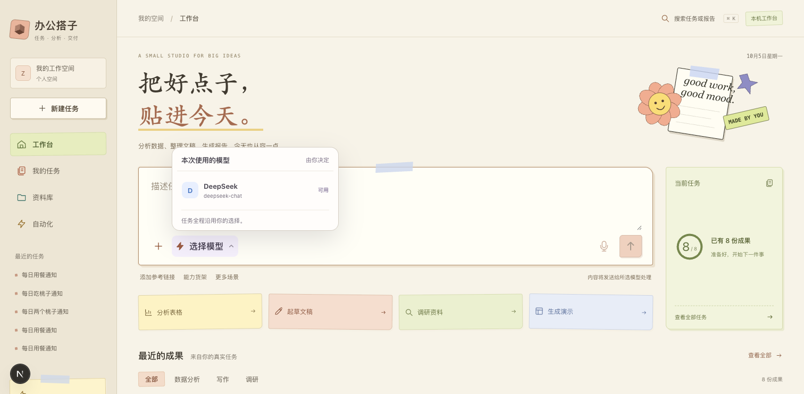

# 本机开发入口交互修复

验收日期：2026-10-05（Asia/Shanghai）。范围：Next.js 开发模式的本机访问来源配置。

## 问题与证据

`http://127.0.0.1:3040/` 返回 HTTP 200，页面能显示，但「选择模型」点击无响应，任务区长期显示「正在读取任务」。按钮 DOM 没有 React 事件属性，页面也未发出业务 API 请求。

前端开发日志记录 `Blocked cross-origin request`，来源为 `127.0.0.1`，目标为 `/_next/hmr`；浏览器记录 HMR WebSocket 握手失败 `ERR_INVALID_HTTP_RESPONSE`。对照访问 `http://localhost:3040/` 后，React 完成交互接管，模型菜单可打开，业务 API 正常返回。

本机 Next.js 16.3.8 官方说明位于 `frontend/node_modules/next/dist/docs/01-app/03-api-reference/05-config/01-next-config-js/allowedDevOrigins.md`。该版本开发服务默认允许 localhost、其子域和启动主机；额外来源需在 `allowedDevOrigins` 中按 hostname 配置。

## 修复与验证

在 `frontend/next.config.js` 添加 `allowedDevOrigins: ["127.0.0.1"]`。开发服务自动重新加载配置后，使用 ego-browser 在原地址验证：

- 首页完成 React 交互接管，任务区不再停在「正在读取任务」。
- 点击「选择模型」后出现「本次使用的模型」菜单及可用模型。
- 点击「我的任务」后进入 `/?panel=tasks`，显示真实任务列表。
- `/api/models`、`/api/tasks`、`/api/workspace` 等已发出的业务请求均返回 HTTP 200；本轮浏览器未捕获脚本异常或失败请求。

本次为开发配置修复，验证范围为上述真实浏览器交互，未新增自动化测试或重跑无关业务流程。

## 用户复核

打开或刷新 `http://127.0.0.1:3040/`，依次点击「选择模型」和「我的任务」。菜单应展开，任务页应切换并加载列表。开发模式备用入口为 `http://localhost:3040/`。
