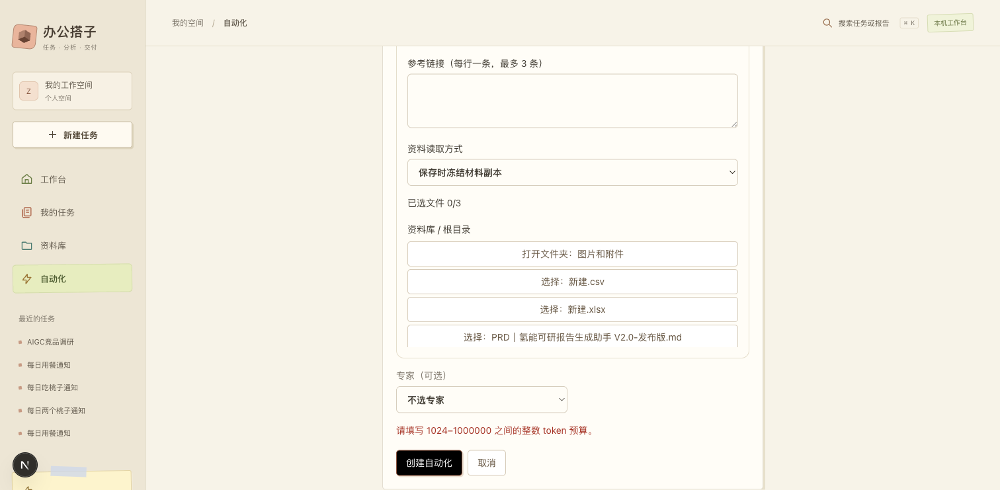

# 自动化提交反馈修复

验收日期：2026-10-05（Asia/Shanghai）。范围：自动化创建与编辑表单的校验和请求状态反馈。

## 复现与根因

用户截图的 token 预算框仍显示「例如 50000」，该文字为 placeholder，实际输入为空。选择运行模型并填写任务内容后，保持预算为空，在长表单底部点击「创建自动化」：没有发出 `/api/schedules` POST；前端校验阻止提交。

修复前，错误为「请填写 1024–1000000 之间的每次 token 预算。」，显示在表单顶部。在本次浏览器视口高度 741px 下，该提示顶部坐标为 -677px，完全不在用户当前视野内，因此表现为按钮无反馈。缺模型和后端返回错误也使用同一个顶部提示。

## 修改

`frontend/components/ScheduleEditor.tsx` 将错误提示移到提交按钮上方；预算增加整数校验并保留 1024–1000000 的范围限制；请求期间显示「创建中…」或「保存中…」，并禁用重复提交。

## 验证

| 场景 | 结果 |
| --- | --- |
| 模型已选、预算为空，底部提交 | 错误立即可见，提示顶部坐标 641px、底部 661px；实际 POST 为 0 |
| 预算为 50000、模型未选 | 「请先选择自动化使用的模型。」在按钮旁可见；实际 POST 为 0 |
| 模型已选、预算为 1024.5 | 整数预算错误可见；实际 POST 为 0 |
| 模型与预算有效，浏览器拦截创建请求并保持待响应 | 每次点击只有 1 次提交调用；按钮显示「创建中…」且禁用；提交值保留所选模型与预算 50000，资料可为 0 项 |
| 浏览器模拟后端错误信封与 HTTP 422 | 错误在按钮旁可见，任务内容保留，按钮恢复可重试；模拟返回 `TEST_VALIDATION: 模拟后端拒绝：用于验证错误提示` |
| `npm run typecheck` | 退出码 0 |
| `node_modules/.bin/biome lint components/ScheduleEditor.tsx` | 退出码 0，检查 1 个文件，无自动修复 |

模拟请求仅用于验证表单反馈，未向后端创建自动化规则。浏览器拦截在结束前恢复，检查用 TaskSpace 已关闭。成功创建业务流程未在本次重新执行。

## 用户复核

刷新 `http://127.0.0.1:3040/?panel=schedules`。填写任务内容后，缺模型或预算时点击创建，应在按钮旁立即显示需要补全的字段。预算需由用户填写为 1024–1000000 的整数；输入框占位文字不代表已填值。
