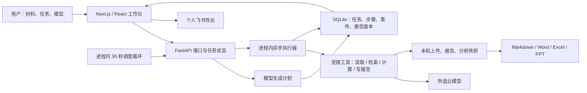

# AI办公搭子 · 整体链路自查

> 历史基线说明：本文保留修复前的自查、复现和优先级。随后用户要求修复全部 12 项；F01–F12 现已完成修复与回归，当前结论见[12 项修复验收](2026-10-04-12项缺口修复验收.md)。下文“尚未修复”等均描述本次修复前的状态。

日期：2026-10-04（Asia/Shanghai）。代码基线：`07f060a`。范围：该项目的架构、技术依赖、前后端链路、材料处理、模型执行、报告交付、版本、自动化及恢复能力。

## 结论

**主要成功路径可用，但整体链路尚不完善。** 当前定位应为“本机单用户开发验证版本”，不能宣布为稳定交付版本或可直接对外上线版本。

Next.js/React + FastAPI + SQLite + Office 处理库的组合，能够支撑当前个人本机办公场景；主要问题不是缺少更多框架，而是若干状态转换、材料边界、文件写入和调度机制没有收口。已有 126 项测试通过，却未覆盖本次复现出的多项异常路径。

本轮完成自查、隔离复现和文档补充，未修改业务代码或升级依赖。下列缺口仍然存在，不能因写进文档而视为已修复。

## 1. 当前架构是什么

它是“模型规划 + 预定义工具执行”的办公流程系统。技能与专家主要通过提示词和固定规划规则影响执行，不是任意工具、浏览器或操作系统能力都能调用的通用 Agent。

| 层 | 实际技术/职责 | 适配判断 |
| --- | --- | --- |
| 前端 | Next.js 14.2.35、React 18、TypeScript、Tailwind/CSS Modules | 可承担当前 UI；14.x 已不受官方支持，需单独安排升级和回归 |
| API 与校验 | Python 3.12、FastAPI、Pydantic、HTTPX | 技术选择合理；规划在请求中等待模型，执行在同一服务进程内，错误与重试机制不足 |
| 任务执行 | `asyncio.create_task`、进程内任务字典、步骤落库 | 单进程可用；没有独立的持久任务调度机制，规划恢复和运行互斥存在缺口 |
| 数据 | SQLAlchemy + SQLite + 本机文件，报告有版本表 | 符合个人本机场景；不是多人共享架构，尚缺正式迁移、备份恢复演练和依赖锁定 |
| 表格 | openpyxl、确定性计算、分析快照与原生图表 | 是当前较扎实的能力；不能据此承诺任意表格语义、复杂关联或专业 BI |
| 文档 | pypdf、python-docx、python-pptx | 支持常规导入/导出；长文本、DOCX 表格和扫描 PDF 等输入覆盖不完整 |
| 自动化 | 30 秒循环 + 同一任务服务 + 跑次表 | 正常跑次有记录；重入、暂停终态、崩溃中的跑次与材料传递尚不完整 |
| 模型/外部集成 | 四家兼容 Chat Completions 配置、Tavily、飞书 OAuth | DeepSeek 有真实验证；其他厂商和本轮未重验的外部链路不能标为全部通过 |
| 桌面 | Electron 窗口壳 | 复用本机 Web 服务，不是独立后端，也不代表具备一键安装、托管和自动更新 |

建议保留现有技术主干，优先补状态机、材料契约和调度互斥；不为“架构看起来完整”引入微服务或另一套 Agent 框架。

## 2. 本轮检查了什么

| 检查项 | 证据 | 结果与限度 |
| --- | --- | --- |
| 现有后端测试 | 本机项目虚拟环境执行 pytest | **126 passed，1 warning**；全部是工程测试，不能替代真实内容质量验收 |
| 前端类型与 Lint | typecheck、lint | 均通过 |
| 前端生产构建 | 同一代码基线在上一轮已构建并实际提供服务；本轮没有业务源码变更 | 沿用该构建证据，未再次中断服务重建 |
| 新版真实周报 | 浏览器创建任务，选择 DeepSeek，实际生成 | 成功；输入给出的事实与完成状态得到保留 |
| 章节改写与版本恢复 | 浏览器改写本周进展，v1→v2→恢复为v3 | 章节外正文逐字相同；v3 正文与 v1 完全相同 |
| Word 交付 | 浏览器下载恢复后的 v3 | ZIP 结构正常，17 个包条目，正文中的关键事实保留；本轮未做 Office 排版渲染验收 |
| 给定网页资料简报 | 实际 DeepSeek 任务读取 Next.js 官方支持页并生成简报 | 成功，执行证据显示读取 1 个链接、3,556 字符；不是 Tavily 搜索重验或所有网页兼容性验收 |
| CSV 全链路 | 本日上一轮真实任务及本轮页面复查 | 原样例 4 行，销售额 900、订单数 18、月份 300/600；Excel/Word/PPT 下载证据保留 |
| 异常路径 | 临时数据库与合成材料的复现脚本 | 8 组探针复现 7 类后端缺口，另有 1 类浏览器缺口 |
| 依赖风险 | npm audit 全依赖与仅生产依赖 | 全依赖 10 个受影响包条目：1 critical + 9 high；生产依赖 2 个：Next critical、传递 PostCSS high |
| 文档与需求 | 当前 PRD、架构、API、状态与实现对照 | 已补用户/场景/竞品与验收要求；将未满足要求明确标为待修 |

运行状态复查：后端 health、models、schedules、workspace 均为 HTTP 200；LLM_MOCK=false、SEARCH_MOCK=false；仅 DeepSeek 配置可用，资料库已配置。

新建的两个任务仅含本次合成材料或公开网页，保留用于复查：

- 周报：`9973aeb7-5a62-4628-bf8d-98f60f8ccf0f`；DeepSeek / deepseek-chat；v1 145 字符、v2 138 字符、v3 145 字符。
- 给定网页简报：`96db48b2-b3b4-4615-ac76-5312da6dc40b`；DeepSeek / deepseek-chat；4 步完成。
- 先前 CSV：`ce4623ea-35f4-4259-b57f-b892805a2a04`。任务可能按既有规则自动归档，报告仍可通过任务 URL 查看。

未发送飞书文档或群消息，未改既有自动化开关，未删除用户任务，未重启正在使用的后端。临时复现数据由脚本自动清理。测试警告涉及 Starlette 测试客户端建议迁移 HTTP 客户端，不影响本轮 126 项通过，但也反映依赖维护需要跟进。

## 3. 已确认的缺口

优先级含义：P1 为影响当前材料、状态或持续可靠运行，应先处理；P2 为体验、可维护性或进一步扩大使用前要补齐。编号对应 PRD 的验收表。

### F01 · P1：计划可读取本次未选择的资料库文件

**触发**：计划出现 `read_workspace` 或其别名 `read_local`，即调用整个授权根目录的摘录收集函数，而不检查本次任务选了哪些文件。

**复现**：合成资料库放入唯一标记，本次任务附件数为 0；执行含上述步骤的合法任务后，标记进入模型输入，任务成功。这里是“授权目录内、但未被当前任务选择的文件”，不是越过目录路径限制。

**影响**：与当前 PRD 的“明确选择后才加入任务”不一致；无关资料可能进入报告上下文或被发给云模型。

**定位**：[执行器](../../backend/app/services/tasks.py) 818–823 行；[目录摘录](../../backend/app/services/workspace.py) 164–192 行。

**修复标准**：执行器只使用任务已保存的材料引用，或为独立的目录读取权限设置清晰且可验证的任务授权；未选标记不得进入任何模型调用。

### F02 · P1：普通文档会静默漏掉内容

**复现**：14,028 字符 TXT 只保存 12,000 字符摘录，尾部唯一事实丢失；DOCX 单元格中的唯一事实也未提取。

**原因**：文件提取固定截断，Word 只遍历段落；执行器还把多份普通材料合并截到 12,000 字符。完整文件虽已保存，后续模型使用的是摘录。扫描 PDF 无 OCR。

**影响**：用户以为整份文档被纳入分析，实际关键事实可能遗漏。不能把“支持上传 PDF/DOCX”解释为能完整理解任何文档。

**定位**：[文件提取](../../backend/app/services/files.py) 75–94 行；[执行器](../../backend/app/services/tasks.py) 735–742、812–813 行。

**修复标准**：补文档表格提取；明确覆盖范围、截断和无法解析的部分；长材料采用有边界的分段处理或明确拒绝，不能无提示截断。

### F03 · P1：资料库第三次上传同名文件会覆盖第二次

**复现**：连续上传不同内容的 `same.csv`，返回路径依次为 `same.csv`、`same_new.csv`、`same_new.csv`；第二份内容被第三份覆盖。

**影响**：直接损失用户资料，且没有覆盖确认。任务附件上传使用唯一名，问题发生在资料库上传。

**定位**：[资料库上传](../../backend/app/services/workspace.py) 155–159 行。

**修复标准**：使用唯一文件标识或循环重名检查；验证连续、并发和已有 `_new` 文件的情况，原文件内容不改变。

### F04 · P1：规划阶段中断后可能永久停在 planning

**复现**：隔离数据库中同时准备 `planning` 和 `running` 任务，执行启动恢复函数；running 转为 paused，planning 保持 planning；常规 replan 返回 INVALID_STATE。

**影响**：用户可能一直看到“规划中”，页面继续轮询，却没有后台工作继续。现有“重启可恢复”的说法只覆盖一部分状态。

**定位**：[恢复函数](../../backend/app/services/tasks.py) 450–458 行；[常规重规划校验](../../backend/app/services/tasks.py) 607–611 行；[前端轮询](../../frontend/app/page.tsx) 714–720 行。

**修复标准**：为规划增加开始时间、超时/中断状态与安全重试路径；启动时覆盖 planning 与自动化未完成跑次。本轮验证的是隔离恢复函数，没有中断生产进程。

### F05 · P1：旧计划接口可绕过运行状态保护

**复现**：调用实际 API 处理函数 `POST /api/tasks/{id}/plan`，对 running 任务返回 plan_ready，并替换计划。新的 replan 接口有保护，旧接口没有。

**影响**：接口仍可使运行中的任务重建步骤；若旧执行器还在工作，会发生状态与步骤竞态。这一并发后果由代码推导，本轮没有对生产中的运行任务做破坏性验证。

**定位**：[旧接口](../../backend/app/api/tasks.py) 89–92 行；[计划生成](../../backend/app/services/tasks.py) 510–513、576–587 行。

**修复标准**：统一所有计划入口的状态校验和执行互斥；运行中不允许重建，暂停后也需确保旧执行器已退出。

### F06 · P1：自动化暂停会被记录为成功

**复现**：在隔离自动化执行中注入 paused 结果，实际任务为 paused，但对应跑次为 success，错误为空。

**原因**：调度逻辑只区分 failed 和“其余状态”，没有要求 succeeded。

**影响**：历史与站内通知可能显示成功，用户却拿不到完成的报告。

**定位**：[自动化终态处理](../../backend/app/services/schedules.py) 498–529 行。

**修复标准**：仅 succeeded 且产物可读才记成功；paused/cancelled/interrupted 等分别记录并有恢复方式。

### F07 · P1：自动化缺少重入保护与开始时的持久记录

**复现**：两个独立数据库会话同时触发同一自动化，创建了 2 个任务、2 条成功跑次，没有互斥。

**代码事实**：跑次在执行结束后追加；到期调度逐个等待执行；每个服务进程启动自己的调度循环。当前不存在租约、运行中记录或幂等键。

**影响**：手动执行与到期触发重叠可能重复消耗；多进程启动也有重复执行风险。进程在规划/执行中退出时，跑次历史不足以准确恢复这次尝试；长任务还会延后同一循环中的后续自动化。后几项是静态架构判断，未做多进程压测。

**定位**：[调度](../../backend/app/services/schedules.py) 452–598 行；[循环](../../backend/app/services/scheduler_loop.py) 12–24 行；[启动](../../backend/app/main.py) 35–36 行。

**修复标准**：启动前原子创建 running 跑次并取得执行权；相同自动化设置并发策略、幂等和超时；恢复可识别未完成跑次。当前单机可以先实现持久记录与锁，不必直接扩成微服务。

### F08 · P2：移除最后一份表格后，普通写作仍可能被阻断

**浏览器复现**：添加 CSV → 移除 CSV → 输入普通润色要求 → 选择 DeepSeek → 发送。页面仍提示“表格分析请先上传…”，附件为 0，未调用创建任务接口。

**原因**：文件移除没有对称清除表格需求状态；新文本未匹配另一场景时，旧技能继续生效。

**定位**：[附件状态回调](../../frontend/app/page.tsx) 1589–1594 行；[创建守卫](../../frontend/app/page.tsx) 874–883 行。

**修复标准**：显式选择的技能与附件推导的临时状态分开管理；添加、移除、换场景、普通输入形成一套完整转换。临时可点击“新建任务”重置后再提交。

### F09 · P2：模型调用与失败恢复还不完整

规划有 3 次尝试和计划结构校验；单次模型 HTTP 超时 90 秒。但分析、成稿和改写的底层调用只请求一次，没有统一的重试/退避策略。执行中的普通异常合并为 RUN_FAILED，权限、额度、超时、限流与无效响应难以区分；没有保存模型实际用量。

**定位**：[模型请求](../../backend/app/services/llm.py) 12–35 行；[规划重试](../../backend/app/services/tasks.py) 539–555 行；[执行错误](../../backend/app/services/tasks.py) 658–689 行。

**修复标准**：按可重试/不可重试错误分类，有限重试并记录必要诊断信息；保留人工继续和重规划入口；不回显密钥或原始文档。生成成功只表示流程结束，事实、来源、长度和格式仍需内容级验收。

### F10 · P1（维护/扩大发布前）：前端依赖已超支持期且存在安全告警

安装版本为 Next.js 14.2.35，[官方支持政策](https://nextjs.org/support-policy) 已将 14.x 列为 unsupported。

本次 `npm audit` 的受影响包条目共 10 个；去掉开发依赖后仍有 Next（critical）及其传递 PostCSS（high）。计数是包条目，不是独立漏洞数量。不同公告有不同的触发条件，**这不等于已证明本机应用的全部风险都可被利用**；本轮未执行漏洞利用或渗透测试。

**修复标准**：选受支持稳定版本，评估 Next/React 迁移影响并验证构建、任务、导出与模型界面；处理传递依赖，留可复现锁文件。本轮未自动升级或运行 audit fix。

### F11 · P2：工程与维护保障尚未形成闭环

前端有 package-lock；后端 requirements 只有最低版本约束，没有已发现的 uv.lock/requirements.lock。项目未发现 GitHub Actions 工作流，也没有项目内备份恢复脚本。前端主页面集中约 2,780 行业务状态，附件残留状态问题说明维护复杂度已经有实际后果。

**影响**：换机器安装结果可能不同；持续改动容易漏掉浏览器状态问题；本机数据存在但未形成经验证的灾备流程。

**修复标准**：锁定后端可复现依赖，增加关键异常与浏览器场景回归；维护数据库与文件的一致备份及恢复演练；按业务边界拆分状态，避免为重构而重构。本轮未进行后端依赖漏洞审计和负载压测。

### F12 · P2：自动化还不能兑现“完整重复交付”

创建跑次只携带提示词、技能、专家、模型，URL 固定为空；没有持久的材料绑定或每期最新文件选择。A 成功触发 B 是事件信号，没有自动把 A 的报告作为 B 的输入。

自动化直接以 `confirm_cost=True` 执行；费用估算取计划的 token 估计和单一价格配置，不记录真实响应用量。普通任务的软阈值不能等同于自动化预算或实际账单上限。

**当前真实配置**：4 条既有自动化均启用，包含 1 分钟、2 分钟、1,440 分钟的间隔任务，以及 1 条上游成功触发任务。它们均为未保存 model_id 的历史配置，继续走全局模型兼容路径；服务当前是非 mock 模式。它们会持续产生任务，实际用量尚无台账，本轮没有改变其开关、周期或模型。此事实与“新建自动化必须选模型”的新规则应分开理解。

**定位**：[自动化创建执行](../../backend/app/services/schedules.py) 474–488 行；[成功触发](../../backend/app/services/schedules.py) 324–355 行；[估算](../../backend/app/services/costing.py) 8–11 行。

**修复标准**：明确每次跑什么材料、哪一版输入、是否使用上游结果；建立自动化的预授权预算与超限行为；记录实际用量。尚未实现前，只描述为“定时重复当前文字任务”。

## 4. 哪些属于边界，不应误写成故障

- 本机单用户、SQLite 和单服务进程是当前选定范围，不能仅因没有微服务而判架构错误。
- 没有登录、多租户、服务端角色权限和公网部署，是已声明的未实现范围；隐藏管理员按钮只是界面整理。
- GPT、通义千问、豆包没有本项目真实调用验收；当前用户菜单只出现 DeepSeek 是配置状态，不能用模拟结果替代验证。
- 语音识别、浏览器控制、任意代码执行、复杂 BI、完整 Office 编辑器和跨系统协作不在当前完成范围。
- 本机保存与云模型处理可以同时存在，不能宣称“所有数据都不离开电脑”。
- 本轮未重新外发飞书或重验 Electron 安装包，保留原历史证据，不延伸为当前全量通过。

## 5. 推荐修复与验收顺序

**第一批：避免读错、覆盖和假完成。** 处理 F01/F02/F03/F04/F05/F06，加入本轮复现用例作为回归门槛；验收未选资料不进入上下文、同名文件不覆盖、规划可恢复、运行不可重建、暂停不显示成功。

**第二批：让常用任务稳定。** 处理 F07/F08/F09，补调度运行记录、重入策略、输入状态转换和错误分类；以 S1 数据复盘、S2 周报为端到端样例，从输入到修改、恢复和下载完整验证。

**第三批：维护与重复交付。** 处理 F10/F11/F12，完成受支持依赖迁移、可复现环境、备份恢复和自动化材料/预算，再讨论扩大用户或部署。

依赖问题与可靠性修复可以分别准备，但发布验收都要覆盖；不能先扩新功能再把这些缺口留到最后。

## 6. 对产品与 PRD 的影响

当前 PRD 已由功能清单补成用户与任务定义，明确：

- 第一优先服务运营数据复盘和项目周报；研究简报为第二优先，纪要/邮件等保留为辅助场景。
- 每个场景写明触发、已有材料、用户问题、执行流程、交付物、验收与当前边界。
- 对照 WorkBuddy、WPS AI/灵犀、飞书 aily 的官方公开定位，不把文件生成、多模型、技能、自动化包装为独有优势。
- 差异化方向集中在可复算数据、任务内修改与版本、少数中文办公场景的交付体验；目前只有实现基础，尚无优于竞品的同题实测。
- “主流程成功”与“整体完善”分开；用户画像、节省时间和商业价值中未经验证的部分均标明为假设。

现行文档：[PRD](../PRD/PRD-当前版本.md)、[项目状态](../项目状态.md)、[架构](../阶段文档/架构方案.md)、[使用与故障排查](../使用与故障排查.md)。

## 7. 可复查证据

- [隔离复现脚本](../evidence/整体链路自查/reproduce.py)：运行数据在临时目录，LLM/search/Feishu 均为显式 mock；不操作生产数据库。
- [移除表格后被阻断](../evidence/整体链路自查/移除表格后任务仍被阻断.png)。
- [真实周报改写与版本恢复](../evidence/整体链路自查/真实周报改写与版本恢复.png)。
- [恢复后的 Word 下载](../evidence/整体链路自查/自查周报-v3.docx)。
- [上一轮真实 CSV 与 Office 交付证据](../evidence/真实工作流接通/验收说明.md)。

本轮范围内，结论依据依次为：实际复现、运行结果、代码事实、官方依赖说明。未执行的验证已明确标出；没有用“测试全过”代替所有链路的判断。
